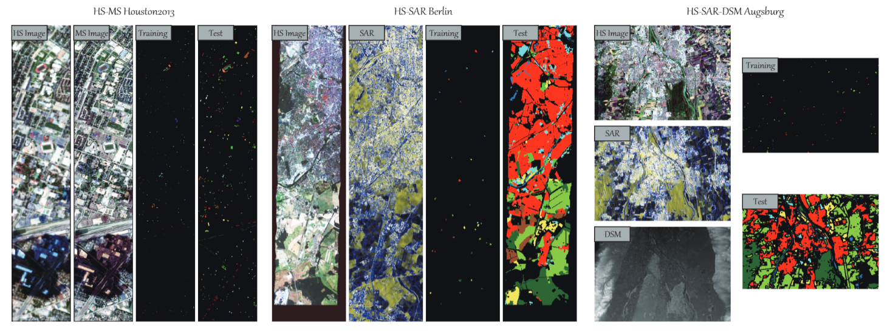

# Multimodal Remote Sensing Benchmark Datasets for Land Cover Classification with A Shared and Specific Feature Learning Model

[Danfeng Hong](https://sites.google.com/view/danfeng-hong), Jingliang Hu, Jing Yao, [Jocelyn Chanussot](http://jocelyn-chanussot.net/), [Xiao Xiang Zhu](https://scholar.google.com/citations?user=CNakdIgAAAAJ&hl=zh-CN)

___________

The code in this toolbox implements the ["Multimodal Remote Sensing Benchmark Datasets for Land Cover Classification with A Shared and Specific Feature Learning Model"](https://www.sciencedirect.com/science/article/pii/S0924271621001362). More specifically, it is detailed as follow.

Citation
---------------------

**Please kindly cite the papers if this code is useful and helpful for your research.**

Danfeng Hong, Jingliang Hu, Jing Yao, Jocelyn Chanussot, Xiao Xiang Zhu. Multimodal Remote Sensing Benchmark Datasets for Land Cover Classification with A Shared and Specific Feature Learning Model, ISPRS Journal of Photogrammetry and Remote Sensing, 2021, 178: 68-80.

     @article{hong2021multimodal,
      title     = {Multimodal Remote Sensing Benchmark Datasets for Land Cover Classification with A Shared and Specific Feature Learning Model},
      author    = {D. Hong and J. Hu and J. Yao and J. Chanussot and X. Zhu},
      journal   = {ISPRS J. Photogramm. Remote Sens.},
      volume    = {178},
      pages     = {68-80},
      year      = {2021}
     }

System-specific notes
---------------------
The code were run with Matlab R2016a or higher versions on Windows 10 machines.

How to use it?
---------------------
This toolbox consists of three multimodal feature learning appraoches, i.e., CoSpace-l2, CoSpace-l1, S2FL. More significantly, three multimodal remote sensing benchmark datasets, e.g., HS-MS Houston2013, HS-SAR Berlin, and HS-SAR-DSM Augsburg, are freely and openly available from the following link, contributing to the community. For more details, please refer to the paper.

Google drive: https://drive.google.com/file/d/1dLJJrNJpQoQeDHybs37iGxmrSU6aP2xv/view?usp=sharing

Baiduyun: https://pan.baidu.com/s/14OQW-9EpGRODOEnWfBXnag (access code: ekqq)

If these datasets and codes are helpful and useful for your research, please kindly cite our papers !!!

Licensing
---------

Copyright (C) 2021 Danfeng Hong

This program is free software: you can redistribute it and/or modify it under the terms of the GNU General Public License as published by the Free Software Foundation, version 3 of the License.

This program is distributed in the hope that it will be useful, but WITHOUT ANY WARRANTY; without even the implied warranty of MERCHANTABILITY or FITNESS FOR A PARTICULAR PURPOSE. See the GNU General Public License for more details.

You should have received a copy of the GNU General Public License along with this program.

Contact Information:
--------------------

Danfeng Hong: hongdanfeng1989@gmail.com 
Danfeng Hong is with the Remote Sensing Technology Institute (IMF), German Aerospace Center (DLR), 82234 Wessling, Germany,
                with the Univ. Grenoble Alpes, CNRS, Grenoble INP, GIPSA-lab, 38000 Grenoble, France.
